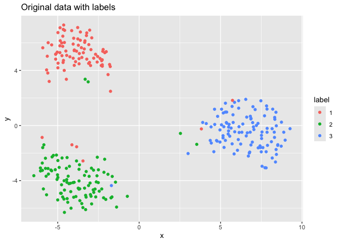
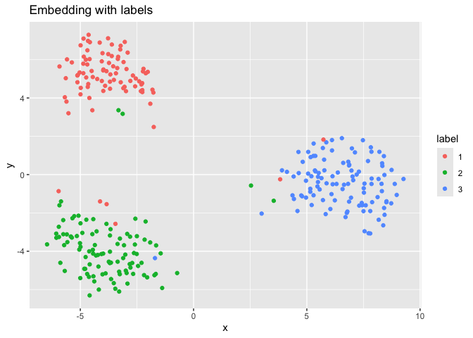
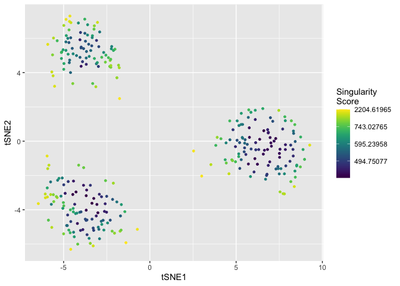
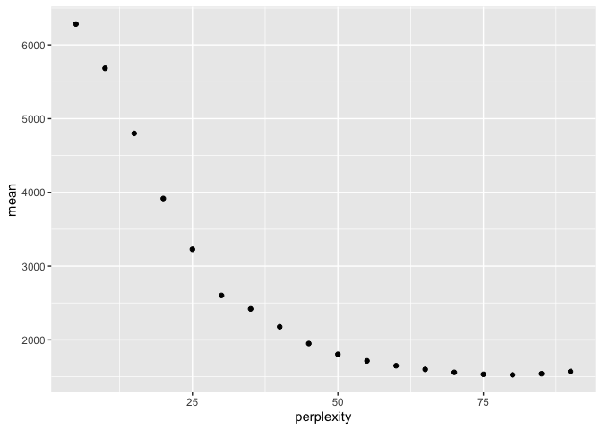
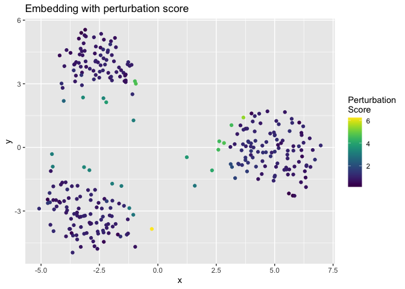
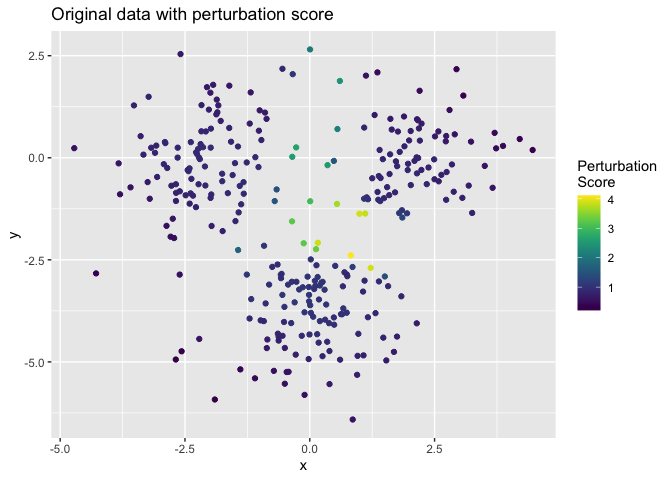

<!-- README.md is generated from README.Rmd. Please edit that file -->

# Map discontinuity based diagnosis for t-SNE

## Installation

To install the package from the github repository, use:

``` r
if(!require(devtools)) install.packages("devtools") # If not already installed
#> Loading required package: devtools
#> Loading required package: usethis
#> Warning: package 'usethis' was built under R version 4.2.3
devtools::install_github("zhexuandliu/SNE-Accountability-MapContinuity/tsneMDBD")
#> Downloading GitHub repo zhexuandliu/SNE-Accountability-MapContinuity@HEAD
#> RcppParallel (NA -> 5.1.9) [CRAN]
#> Installing 1 packages: RcppParallel
#> 
#>   There is a binary version available but the source version is later:
#>              binary source needs_compilation
#> RcppParallel  5.1.7  5.1.9              TRUE
#> installing the source package 'RcppParallel'
#> ── R CMD build ─────────────────────────────────────────────────────────────────
#>      checking for file ‘/private/var/folders/l0/vby06rf51fs3v71m749yv3cc0000gn/T/Rtmpi2vWir/remotes3dc86a075707/zhexuandliu-SNE-Accountability-MapContinuity-46eb4e2/tsneMDBD/DESCRIPTION’ ...  ✔  checking for file ‘/private/var/folders/l0/vby06rf51fs3v71m749yv3cc0000gn/T/Rtmpi2vWir/remotes3dc86a075707/zhexuandliu-SNE-Accountability-MapContinuity-46eb4e2/tsneMDBD/DESCRIPTION’
#>   ─  preparing ‘tsneMDBD’:
#>      checking DESCRIPTION meta-information ...  ✔  checking DESCRIPTION meta-information
#>   ─  checking for LF line-endings in source and make files and shell scripts
#>   ─  checking for empty or unneeded directories
#>   ─  building ‘tsneMDBD_0.1.0.tar.gz’
#>      
#> 
```

## Usage

``` r
### load package and calculate embedding

# Load package
library(tsneMDBD)
library(RtsneWithP)
library(ggplot2)
#> Warning: package 'ggplot2' was built under R version 4.2.3

# generate gaussian mixture data as an example
set.seed(1)
X = MGMM::rGMM(300, d = 2, k = 3, 
         means = list(c(2, 0), c(-2, 0), c(0,-4)), 
         covs = diag(2))
label = factor(rownames(X))

# run t-SNE
PCA_x = prcomp(X)
tsne_out = Rtsne(X, perplexity = 75, theta = 0, 
                 max_iter = 1000, Y_init = PCA_x$x[, 1:2]) # set theta=0 to run exact tSNE
ggplot() +
  geom_point(data = data.frame(
    x = X[, 1],
    y = X[, 2],
    label = label
  ),
  aes(x = x, y = y, color = label)) + 
  ggtitle('Original data with labels')
```

<!-- -->

``` r

ggplot() +
  geom_point(data = data.frame(
    x = tsne_out$Y[, 1],
    y = tsne_out$Y[, 2],
    label = label
  ),
  aes(x = x, y = y, color = label)) + 
  ggtitle('Embedding with labels')
```

<!-- -->

### singularity score

First, we should check the gradient of t-SNE loss function to see
whether local minimum is reached. Small gradients shows that we have
reached local minimum.

``` r
### check whether local minimum is reached
gradient_compute(tsne_out$Y, tsne_out$P)[1:10]
#>  [1] -9.002258e-17 -1.692569e-17 -1.887777e-17 -8.305646e-17  1.549520e-17
#>  [6]  1.774534e-18 -4.506946e-17  2.804973e-17  5.381179e-17 -5.280909e-17
```

After reaching the local minimum, we can calculate the singularity score
for fracture-inducing discontinuity diagnosis.

``` r
### calculate singularity score

# compute the singularity score
sscore = singularity_score_compute(tsne_out$Y, tsne_out$P)

# plot singularity score (colored by quantile)
plot_singularity_score_q(tsne_out$Y, sscore)
```

<!-- -->

``` r
### use singularity score to choose perplexity

# calculate the singularity score for each perplexity candidate
perplexity_candidates = c(seq(5,90,5))
sscore_mat= matrix(NA, nrow = dim(X)[1], ncol = length(perplexity_candidates))
for (i in c(1:length(perplexity_candidates))){
  tsne_out = Rtsne(X, perplexity = perplexity_candidates[i], theta = 0, 
                 max_iter = 1000, Y_init = PCA_x$x[, 1:2]) # set theta=0 to run exact tSNE
  sscore_mat[,i] = singularity_score_compute(tsne_out$Y, tsne_out$P)
}

# plot the mean of top 5% singularity score versus perplexity
# choose the elbow point as the perplexity to use
plot_s_score_perplexity(perplexity_candidates, sscore_mat)
```

<!-- -->

### perturbation score

``` r
### calculate perturbation score

# calculate distance matrix in advance to reduce computation
Y_distsq = as.matrix(dist(tsne_out$Y)**2)

# calculate perturbation score
pscore = sapply(c(1:dim(X)[1]), function(i){
  return(perturbation_score_compute(i, X, tsne_out$Y, Ydist_sq = Y_distsq, perplexity = 75, pca_result = PCA_x, length = 0.5))})
```

``` r
ggplot() +
  geom_point(data = data.frame(
    x = tsne_out$Y[, 1],
    y = tsne_out$Y[, 2],
    score = pscore
  ),
  aes(x = x, y = y, color = score)) +
  viridis::scale_color_viridis(direction = 1,
                        name = "Perturbation\nScore") + 
  ggtitle('Embedding with perturbation score')
```

<!-- -->

``` r
ggplot() +
  geom_point(data = data.frame(
    x = X[, 1],
    y = X[, 2],
    score = pscore
  ),
  aes(x = x, y = y, color = score)) +
  viridis::scale_color_viridis(direction = 1,
                        name = "Perturbation\nScore") + 
  ggtitle('Original data with perturbation score')
```

<!-- -->

# Details

This R package offers functions to calculate singularity score and
perturbation score, to diagnose fracture-inducing and
overconfidence-inducing discontinuities.

# References

\[1\] <https://github.com/jkrijthe/Rtsne>

\[2\] L.J.P. van der Maaten and G.E. Hinton. “Visualizing
High-Dimensional Data Using t-SNE.” Journal of Machine Learning Research
9(Nov):2579-2605, 2008. 
